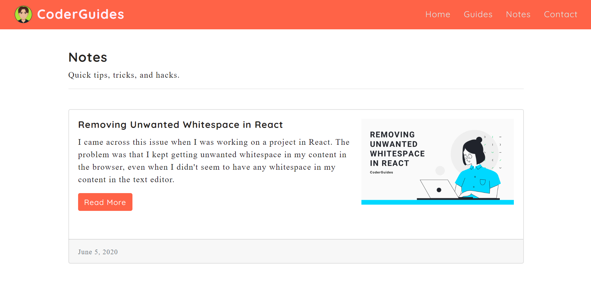
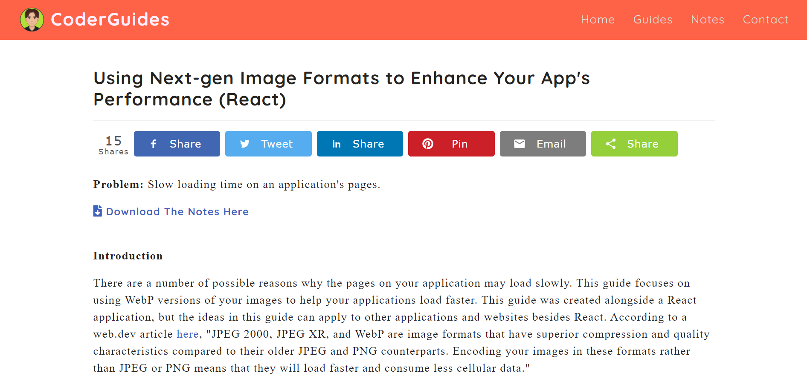
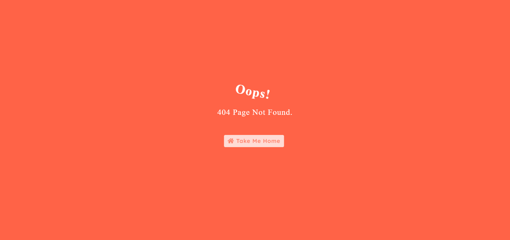

# CoderGuides

# Project Description

CoderGuides is a front-end website created with React. It is dedicated to guides and notes on various topics related to web development. As I explain on the Home Page, I originally created these notes to help me throughout my web development journey. But I decided to create this site to make the notes I've created available, as well as to add more along the way, in hopes of helping others. CoderGuides features two main sections: Guides and Notes. The Guides section contains mini-guides on a variety of topics, while the Notes section contains quick tips, tricks, and hacks.

This responsive front-end React website was created using React Bootstrap, as well as custom CSS. The syntax highlighter, Prism, was used in cases where code snippets were given as examples in the articles. ShareThis social media share buttons were used on the individual article pages to allow users to share the articles on social media. Other features include a React scroll-up-button, the option to download a PDF version of each article, and the use of Animate.css for the animation on the Error Page. The fonts used ('EB Garamond' and 'Quicksand') come from Google Fonts. The icons used come from Font Awesome. Finally, Open Graph meta tags have been added so that when a link to or from the website is shared and posted (e.g. on Facebook), the desired image and text will be shown (see screenshot #6 below). 

# Technologies Used

* React
* React Bootstrap
* CSS
* Prism
* NPM packages: React Router, React Helmet, bcryptjs, and React-scroll-up-button
* ShareThis
* Animate.css
* Font Awesome
* Google Fonts

# CoderGudies Live Link

Please check out the live link for CoderGuides here:

https://coderguides.com/

# Screenshots

